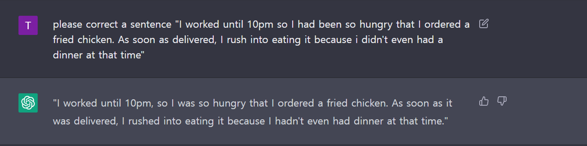
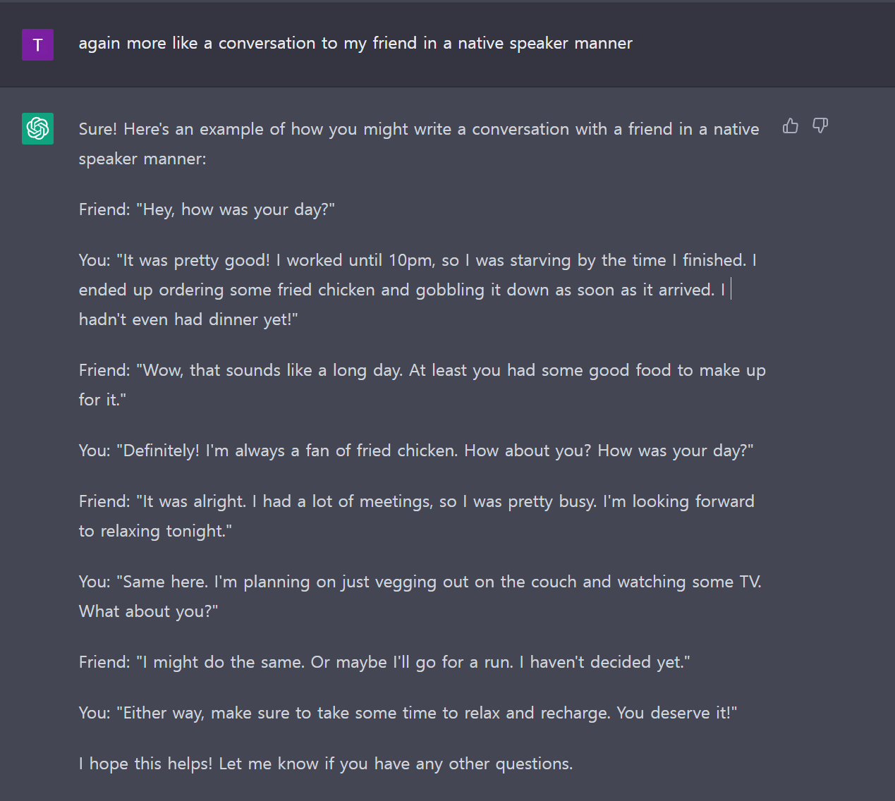
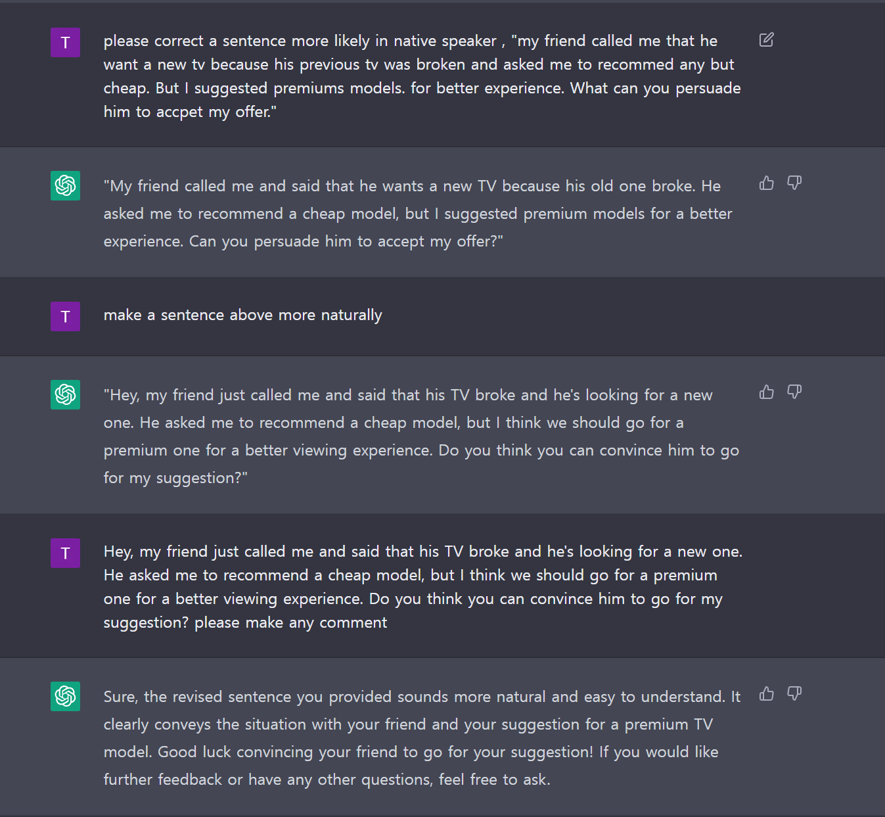
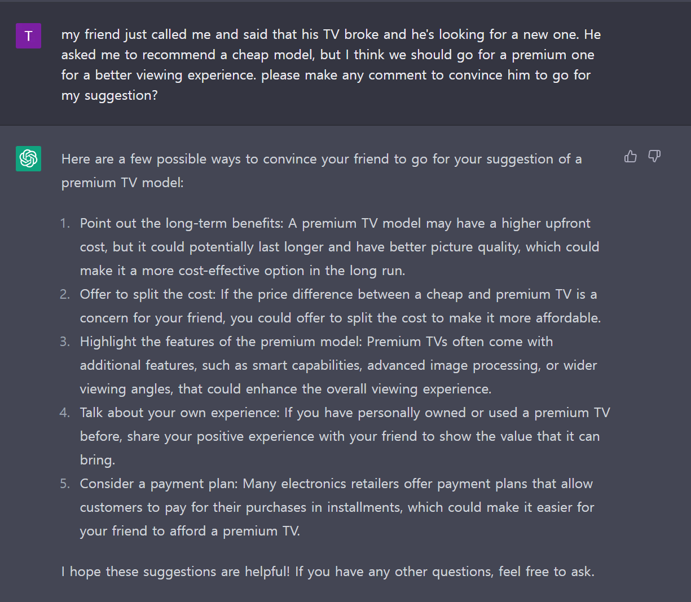

# __Opic__  

## __Subjects__ 

I want AL of Opic...

???+ Info "Clean Code2!"
    === "Samples"
        
        Second one... 문장을 확인해보십시오. 이거 정확한 문법이랍니다.
        
        
        
        
        
        
    === "Hobby"

        To be updated...

